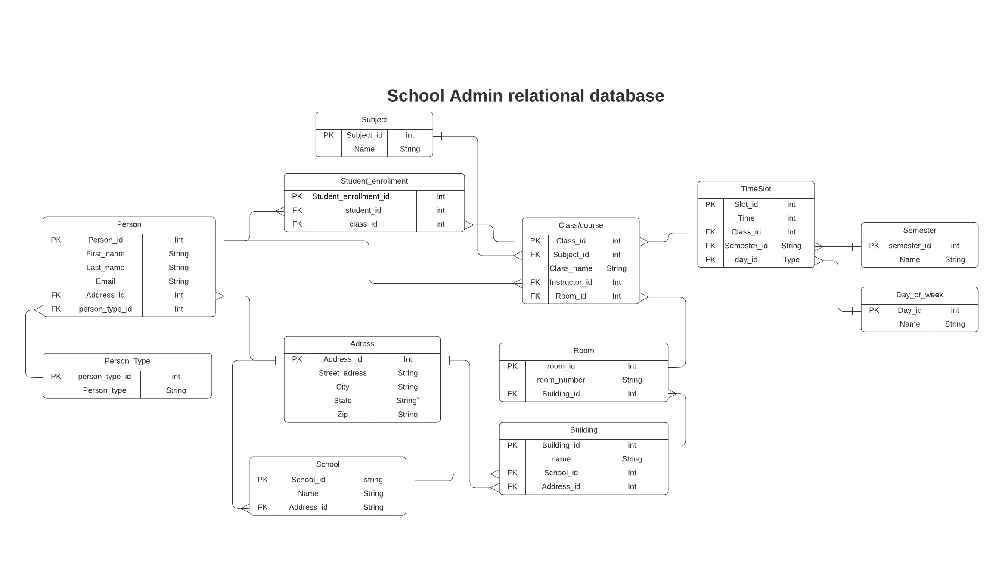

# school administration API

version 1.0

## Description

This is going to be a back end api of students, teachers, and classes. There will a seperate repo for a react front end that will consume this API.

This is a portfolio project, but I want it to seem like this API is real. So I want to fill this API with data from a school that I have created myself. I have mapped out buidlings, rooms, created semesters and courses. There is a filler.py file that is strictly for filling the database with information so the front end has more data to work with.

to generate the campus, staff, students, and classes:

`python manage.py shell`

`from school_api.filler import generate_university`

then type `generate_university()`

## Visuals

I want to keep the data in this API tidy so I read up on relational database planning and came up with this ERD to help me plan out my models. It feels pretty clean compared to my original effort.

## endpoints:

- api/v1/ returns a list of endpoints for the api
- api/v1/people/ returns a list of people on campus
- api/v1/campus/ returns a list of campus navigation
- api/v1/class/ returns a list of classes at the university

## Project status

Actively in development.